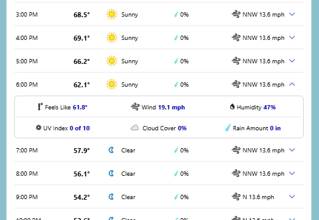

<h1>The Ultime Weather App (Weather Channel Clone)</h1>

A weather app that is as close as can be to a real life weather tracking product. The website follows the exact design and functionality of IBM's Weather Channel's daily weather page and three day forcast page from october 2023. The site in React to ensure a lightning fast browsing experience utilizing the virtual DOM. Functionality was all possible by using the <a href="https://www.weatherapi.com/">WeatherAPI</a>
<ul>
  <li>Built Using React</li>
  <li>Design / Functionality remade from the Weather Channel Website</li>
  <li>Connected to WeatherAPI for daily and 3 day forecasts</li>
  <li>Utilizes Local storage to stop excessive api calls</li>
  <li>Goal was to do a twist on the basic weather app by recreating the Weather Channel fucntionalty and design</li>
  <li>Weather Information will be provided when giving the sites search bar a zipcode or plain english location</li>
  <li>International daily,hourly and three day forecast tempertures as well as stats like uv index, humidity, wind, pressure and much more </li>
  <li>Background and color scheme of site changes dynamically depending on the searched locations time of day/weather</li>
  <li>Uses Local storage to load last searched weather report on page reload</li>
</ul>

<h2>Deployed on Netlify -<a href="https://bejewelled-unicorn-5837be.netlify.app/"> Weather Channel Clone</a></h2>

<a href="https://bejewelled-unicorn-5837be.netlify.app/">Weather Channel Clone Home</a>

 
This nav is to help viewers quickly naviage the 2 pages I've made on the site. Since the project isnt the entire weathe chaneel this nav will help users wuickly go to the main features of the clone
 

 
Seach Bar is the first point of interest to start using the functionality of the site. You can search by zipcodes or by using plain english, the load will be instantanious because of the awesomeness that is React
 

<small>Desktop</small>
 

<small>Mobile</small>
 

Displays dynamic sky image/weather icon depending on time of day and weather forecast. Mobile view display the same information but has animated buttons to display info in a mobile friendly format

 

 

Display dynamic in depth stats daily weather stats for the area searched, with a mini hourly forecast thats expaned on in the <a href="https://bejewelled-unicorn-5837be.netlify.app/details">three day forecast page</a>

 
<a href="https://bejewelled-unicorn-5837be.netlify.app/details">Three Day Forecast Page</a>
 

 

Three day forecast page shows details of the next 3 days with hourly accurate reports with stats

<h2>Tech Used</h2>
<ul>
  <li>HTML</li>
  <li>CSS</li>
  <li>Javascript</li>
  <li>React</li>
  <li>Local Storage</li>
  <li>API Connectivity</li>
  <li>Mobile Responsiveness</li>
</ul>
<h2>ABout Me</h2>
Thank you for checking out my work, I hope you enjoyed my site!
I'm currently searching for a new career opportunity in Web Development and would love to hear from you, so feel free to reach out.
These are my socials:
<a href="mailto:austintorres578@gmail.com">austintorres578@gmail.com</a>
<a href="https://austintorres578.github.io/Web-dev-portfolio/">Portfolio Site</a>
<a href="https://github.com/austintorres578">Github</a>
<a href="https://www.linkedin.com/in/austin-torres-55696420a/">Linkedin</a>

