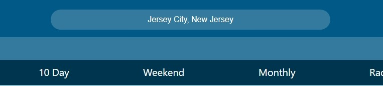

<h1>The Ultimate Weather App (Weather Channel Clone)</h1>

A weather app built to closely replicate a real-life weather tracking platform. This website follows the **exact design and functionality** of IBM’s Weather Channel **Daily Weather** page and **Three-Day Forecast** page from October 2023. It is developed in **React** to ensure a lightning-fast browsing experience using the virtual DOM.  
All weather functionality is powered by the <a href="https://www.weatherapi.com/">WeatherAPI</a>.

<ul>
  <li>Built with React</li>
  <li>Design and functionality recreated from The Weather Channel website</li>
  <li>Connected to WeatherAPI for daily and three-day forecasts</li>
  <li>Uses Local Storage to reduce excessive API calls</li>
  <li>Goal: Reimagine a basic weather app by cloning real Weather Channel features and visuals</li>
  <li>Search by ZIP code or plain English locations</li>
  <li>International forecasts with daily, hourly, and 3-day details including UV index, humidity, wind, pressure, and more</li>
  <li>Dynamic background and color scheme based on time of day and weather</li>
  <li>Automatically loads last searched location using Local Storage</li>
</ul>

<h2>Deployed on Netlify – <a href="https://bejewelled-unicorn-5837be.netlify.app/">Weather Channel Clone</a></h2>

<a href="https://bejewelled-unicorn-5837be.netlify.app/">Weather Channel Clone Home</a>

 
This navigation helps users quickly move between the two main pages of the site. Since this project doesn’t include the entire Weather Channel site, the custom nav provides fast access to key features.
 

 
The search bar is the starting point of the app’s functionality. Enter a ZIP code or a plain English location, and results load almost instantly thanks to React.
 

<small>Desktop</small>
 

<small>Mobile</small>
 

Displays dynamic sky imagery and weather icons based on time and conditions. On mobile, animated buttons provide a touch-friendly layout.

 

 

Shows in-depth daily weather statistics for the selected location, along with a mini hourly preview (expanded further on the <a href="https://bejewelled-unicorn-5837be.netlify.app/details">Three-Day Forecast page</a>).

 

<a href="https://bejewelled-unicorn-5837be.netlify.app/details">Three-Day Forecast Page</a>
 

 

The three-day forecast page provides detailed hourly reports with accurate stats and projections.

<h2>Tech Used</h2>
<ul>
  <li>HTML</li>
  <li>CSS</li>
  <li>JavaScript</li>
  <li>React</li>
  <li>Local Storage</li>
  <li>API Integration</li>
  <li>Mobile Responsiveness</li>
</ul>

<h2>About Me</h2>

Thank you for checking out my work — I hope you enjoyed exploring this project!

I’m currently seeking new opportunities in Web Development and would love to connect.

<strong>My Links:</strong> 
<a href="mailto:austintorres578@gmail.com">austintorres578@gmail.com</a> 
<a href="https://austintorres578.github.io/Web-dev-portfolio/">Portfolio Site</a> 
<a href="https://github.com/austintorres578">GitHub</a> 
<a href="https://www.linkedin.com/in/austin-torres-55696420a/">LinkedIn</a>
